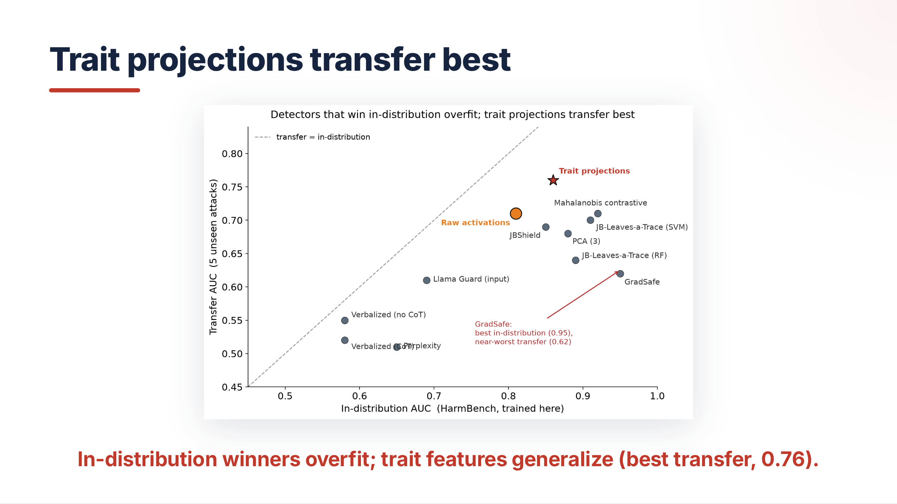
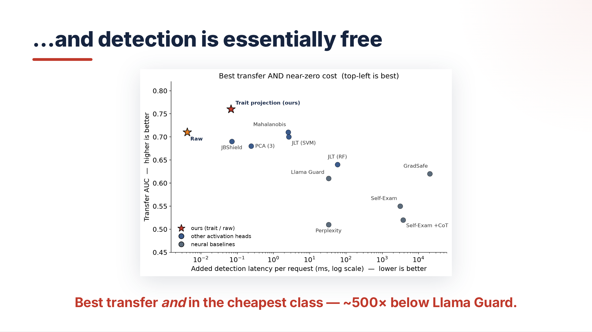

# Additional analysis: persona-level and direction-level interpretability (Llama-3.1-8B, HarmBench)

Everything below was computed on the Llama-3.1-8B / HarmBench setup, layer 16. All scripts live in
`full_trait_tools/` and were run on the cluster (`/dlabscratch1/bazina/assistant-axis-llama3.1-8B/`);
result files referenced as `full_trait_output/...` are cluster-only (not synced to this repo).
CSV exports referenced as `results/...` are in this repo, already committed to this folder.

---

## 1. Per-persona standalone AUC

**Question:** taking each of the 229 persona/trait vectors individually (no combining), how well
does that single direction alone separate jailbroken vs. not-jailbroken on HarmBench?

**Method:** project layer-16 activations onto one persona vector at a time (single scalar feature).
Since AUC of a 1-D score is invariant to monotonic rescaling, this is computed directly as
`safe_auc(y_test, raw_projection)` on the held-out test pool per seed — mathematically identical to
fitting a 1-feature `StandardScaler + LogisticRegression` per persona per seed (verified: max
per-seed difference across 50 seeds = 0.0). Held-out test pool = same behavior/template strict split
used by `run_all_traits_sweep_v2.py` (`get_pool_split` / `split_by_pool`), so results are directly
comparable to the main sweep's `human_test` numbers.

**Robustness check:** ran with three independent seed batches (50 seeds @ 0–49, 50 seeds @
10000–10049, 150 seeds @ 50000–50149) — top-5 ranking identical across all three, AUCs within
~0.01–0.02 of each other. Final reported run: seeds 0–100 (101 seeds, 101/101 used).

**Top 10 (seeds 0–100):**

| Rank | Persona | Mean AUC | Std AUC |
|---|---|---|---|
| 1 | egalitarian | 0.8745 | 0.0540 |
| 2 | universalist | 0.8640 | 0.0675 |
| 3 | principled | 0.8515 | 0.0821 |
| 4 | progressive | 0.8499 | 0.0728 |
| 5 | deontological | 0.8466 | 0.0723 |
| 6 | essentialist | 0.8174 | 0.0979 |
| 7 | avoidant | 0.8154 | 0.0739 |
| 8 | existentialist | 0.8117 | 0.0745 |
| 9 | regulatory | 0.8074 | 0.0785 |
| 10 | utilitarian | 0.8009 | 0.1144 |

Bottom of the range: `deferential` (0.597), `theoretical` (0.600), `contemporary` (0.601) — near chance.

**Context / correction:** a single persona vector (egalitarian, 0.875 AUC) is close to, and by some
seed batches slightly *above*, the full 229-trait combined-feature sweep's best test AUC (0.868,
`all_traits_sweep_v2`, config `linsvm_C0.1_bal`). This was surprising until verified: (a) a single
fixed model config on all 229 features (no per-seed model selection) only gets 0.835 test AUC, and
(b) the top personas are heavily redundant (correlation 0.77–0.97 among egalitarian / universalist /
progressive / principled / deontological) — regularized multi-feature models spread weight thin
across these correlated dims rather than concentrating on the single strongest one. Not a bug,
verified against an actual fitted classifier.

- Script: `full_trait_tools/persona_individual_auc.py` (supports `--seed_offset`, `--n_seeds`)
- Local CSV: `results/persona_individual_auc_seeds0-100.csv` (all 229 traits, ranked)
- Cluster JSON: `full_trait_output/persona_individual_auc_report/results.json`
  (other seed-batch runs also on cluster: `persona_individual_auc/`, `persona_individual_auc_diffseeds/`,
  `persona_individual_auc_150seeds/`)

---

## 2. Transfer-attack AUC for top personas

**Question:** do the top in-distribution personas transfer to detecting other attack families
(GCG, PAIR, PAP, GPTFuzz, PEZ, WJB)?

**Method:** same single-feature raw-projection AUC, computed directly on each transfer family's full
labelled set. Deterministic per persona (no seed dependence — no classifier is fit, so there's no
train/test split to vary; this differs from the in-distribution HarmBench number, which is
seed-averaged over held-out test splits).

| Trait | HB (in-dist) | GCG | PAIR | PAP | GPTFuzz | PEZ | WJB | **AvgXfer** |
|---|---|---|---|---|---|---|---|---|
| egalitarian | 0.875 | 0.768 | 0.790 | **0.500** | 0.659 | 0.834 | 0.745 | 0.716 |
| universalist | 0.864 | 0.702 | 0.723 | 0.512 | 0.672 | 0.640 | 0.729 | 0.663 |
| principled | 0.852 | 0.679 | 0.746 | 0.565 | 0.631 | 0.830 | 0.738 | 0.698 |
| progressive | 0.850 | 0.629 | 0.708 | 0.544 | 0.643 | 0.723 | 0.713 | 0.660 |
| deontological | 0.847 | 0.625 | 0.720 | 0.569 | 0.620 | 0.798 | 0.743 | 0.679 |
| essentialist | 0.817 | 0.552 | 0.676 | 0.510 | 0.634 | 0.771 | 0.711 | 0.643 |
| **avoidant** | 0.815 | **0.769** | **0.799** | 0.558 | 0.647 | 0.813 | 0.734 | **0.720** |

**Key findings:**
- `egalitarian` transfers essentially at **chance (0.500) on PAP** despite dominating in-distribution —
  a persona can be the best in-distribution detector and carry zero standalone signal against a
  specific attack family.
- `avoidant` (ranked #6 in-distribution) has the **best average transfer AUC** (0.720), edging out
  `egalitarian` (0.716) — the best in-distribution persona is not necessarily the best
  transfer/OOD persona.

- Script: `full_trait_tools/persona_transfer_auc.py`
- Cluster JSON: `full_trait_output/persona_transfer_auc/results.json`

---

## 3. PCA decomposition of the raw-activation jailbreak direction

**Question:** decompose the raw-activation (unprojected, 4096-dim) jailbreak classifier's learned
direction into unsupervised PCA components — how much variance does each explain, how much
standalone predictive power does it have on its own, and which persona vectors does it align with?

**Method:** `PCA(n_components=4)` fit once on all raw layer-16 HarmBench activations (unsupervised,
no labels — same status as the fixed persona vectors, no leakage concern). Per PC: standalone AUC
averaged over 101 held-out seeds (same method as §1); classifier weight from a
`StandardScaler + LogisticRegression` fit on the 4 PCA scores per seed, unit-normalized and averaged
across seeds; nearest personas by cosine similarity (top-5 per pole, both positive and negative).

```
PC      Var%   CoefInW    Coef2  StandaloneAUC  Persona profile (top-1 each pole)
PC1      17.7    0.6726   0.4523         0.7963  diplomatic <-> edgy  (-> jailbreak)
PC2      13.2    0.5992   0.3590         0.7370  evil <-> principled  (-> jailbreak)
PC4       7.3   -0.3890   0.1513         0.6460  casual <-> ritualistic  (-> refusal)
PC3       9.2    0.1181   0.0140         0.6621  reserved <-> introspective  (-> jailbreak)

Sum of coef^2 = 0.9766 (should be ~1.0; not exact because per-seed unit-normalized
coefficient vectors are averaged across seeds, which shrinks the norm slightly if the
fit rotates seed to seed — this is expected, not a bug)
```

Top-5 aligned personas per pole (more informative than the single nearest neighbor — shows each PC
axis corresponds to a genuine *cluster* of related traits, not a coincidental single match):

- PC1 jailbreak pole: edgy, sycophantic, goofy, grandiose, mischievous (0.31–0.35 cos-sim) — an
  "unguarded/playful-compliance" cluster
- PC2 refusal pole: evil, condescending, misanthropic, bitter, elitist (0.22–0.25) — a
  "hostile/superior" cluster

Full top-5-per-pole table: `results/pca_direction_decomposition_layer16.csv` (long format: pc, var_pct,
coef_in_w, coef_sq, standalone_auc, direction, pole, rank, persona, cos_sim).

**Comparison to a colleague's earlier slide** (same idea, PCA on raw activations, 4 PCs): same
qualitative structure and same three underlying claims hold in our seed-averaged version:
1. The raw-activation jailbreak direction is concentrated in a handful of components (coef² ≈ 1.0
   when the classifier is restricted to those components).
2. No single PC is a strong classifier alone (0.65–0.80 AUC here vs. 0.87–0.91 combined/full-raw),
   but together they reconstruct most of the decision boundary.
3. These label-free, purely data-driven directions land on recognizable, human-nameable persona
   semantics rather than being abstract noise — validating that the persona-vector framing isn't
   arbitrary.

Exact numbers differ from the colleague's slide (ours: PC1 var=17.7% vs theirs 14.3%; different top
personas per pole) — expected, since likely different fit population (all data vs. train-only),
single-seed vs. seed-averaged fit, and a different/larger persona reference set on their side
(includes a non-standard `assistant_axis` vector not in our 229-trait matrix — see §5 below, this
axis *does* exist in this repo under a different pipeline).

- Script: `full_trait_tools/pca_direction_decomposition.py` (supports `--n_top_personas`)
- Local CSV: `results/pca_direction_decomposition_layer16.csv`
- Cluster JSON: `full_trait_output/pca_direction_decomposition/results.json`

### Framing recommendation for the paper

Resist the headline "jailbreaks exist in a low-dimensional space" as stated — two things cut against
it: (a) the full 4096-dim raw classifier (`all_traits_sweep_v2_raw`, test AUC 0.912) beats a 256-PC
reduction (`all_traits_sweep_v2_pca`, test AUC 0.855) — more dimensions helped, awkward for a strong
"it's all low-dim" claim; (b) transfer to other attack families only averages ~0.72 AUC from the best
single direction (§2), well below the ~0.86–0.91 in-distribution ceiling — a single low-dim direction
does not generalize across attack types.

What the evidence *does* support: **in-distribution jailbreak detection is dominated by a low-rank,
semantically-interpretable subspace of activation space, but this compact subspace does not fully
transfer across attack families** — different attacks likely exploit different, only
partially-overlapping low-dim directions rather than one universal jailbreak axis.

---

## 4. Raw-classifier vs. all-traits-classifier direction alignment

**Question:** how similar is the direction learned by the raw-activation classifier (`w_raw`) to the
direction learned by the all-traits (229-persona-projected) classifier (`w_trait`)? And which personas
does each align with most / least?

**Method — direct comparison of two already-saved, already-fitted vectors, no refitting, no seeds:**
- `w_raw` = `full_trait_output/harmbench_logreg/hyperplane_normal_layer16.pt` (pre-existing artifact
  from `classify_jailbreak_raw_activations.py`, unit-norm, saved ROC-AUC 0.839)
- `w_trait` = `coef_proj` field inside `full_trait_output/all_traits_sweep_v2/best_model.pkl`
  (config `logreg_l2_C10.0_raw`, the actual saved all-traits classifier), mapped back into raw
  4096-dim space via that same file's `trait_matrix` (`trait_matrix.T @ coef_proj`, then unit-normed)
  so it's directly comparable to `w_raw`.

**Result: overall `cos_sim(w_raw, w_trait) = 0.1180`** — the two classifiers' learned directions are
only weakly aligned.

**Top 10 personas aligned with `w_raw`** (|cos_sim|, sign-agnostic):

| Rank | Persona | cos_sim |
|---|---|---|
| 1 | challenging | −0.055 |
| 2 | deconstructionist | −0.055 |
| 3 | quantitative | −0.048 |
| 4 | analytical | −0.045 |
| 5 | egalitarian | +0.043 |
| 6 | impulsive | +0.042 |
| 7 | pedantic | −0.041 |
| 8 | introverted | −0.041 |
| 9 | principled | +0.036 |
| 10 | paranoid | −0.035 |

**Top 10 personas aligned with `w_trait`'s raw-space direction:**

| Rank | Persona | cos_sim |
|---|---|---|
| 1 | relativist | −0.197 |
| 2 | constructivist | −0.155 |
| 3 | anthropocentric | −0.152 |
| 4 | eclectic | −0.138 |
| 5 | dominant | −0.138 |
| 6 | convergent | −0.132 |
| 7 | pacifist | −0.125 |
| 8 | sardonic | +0.122 |
| 9 | impatient | −0.121 |
| 10 | urgent | −0.116 |

Note the two top-10 lists barely overlap (only `egalitarian`/`principled` appear weakly on the
`w_raw` side and not at all on `w_trait`'s side) — consistent with the weak 0.118 overall alignment.

**⚠️ Open caveat before trusting this for the paper:** `w_trait`'s source config
(`logreg_l2_C10.0_raw`, i.e. **C=10, very weak L2 regularization, class_weight=None**) fit on 229
heavily-correlated features (recall correlations up to 0.97 among the ethics-cluster personas in §1)
looks unstable — its raw coefficient ranking (`trait_importance` in the pkl) is dominated by
`paranoid`, `confrontational`, `regulatory`, `gregarious`, `risk_taking` (coef magnitudes 4–5.5),
which **does not include `egalitarian` at all**, despite it being the clear best standalone predictor
in §1. This is the classic multicollinearity failure mode: weak regularization + correlated features
→ large, arbitrary, noise-driven coefficients. **Recommendation: refit `w_trait` with a properly
regularized config (smaller C, or L1) and re-check whether the 0.118 alignment and the top-10 lists
hold up before citing them** — if they do, it's a solid result; if the number moves substantially, the
current 0.118 is mostly a regularization artifact, not a real finding about how the two
representations relate.

**How to read 0.118 either way (once/if confirmed robust):** if the paper's story is "different
representations of the same phenomenon converge to the same direction," 0.118 undercuts that. If the
story is "there's no single universal jailbreak direction — different methods carve up the
low-rank subspace differently" (consistent with §2's transfer gap and §3's multiple distinct PCs),
weak alignment here actually supports that more nuanced framing.

- Script: `full_trait_tools/raw_vs_trait_classifier_alignment.py` (direct vector load, no fitting)
- Local CSVs: `results/raw_vs_trait_classifier_alignment.csv` (top/bottom-10 both views),
  `results/raw_vs_trait_classifier_alignment_all_personas.csv` (all 229 personas, both alignment scores)
- Cluster JSON: `full_trait_output/raw_vs_trait_alignment/results.json`

---

## 5. Pre-existing related infrastructure discovered mid-investigation

While tracking down `w_raw`, found a substantial pre-existing analysis pipeline already on the
cluster (not previously known to this session) worth cross-checking against the above before
finalizing the report, since it may have produced some of the numbers already discussed with
collaborators:

- `full_trait_tools/classify_jailbreak_raw_activations.py` — trains + saves `w_raw` per layer
- `full_trait_tools/compare_hyperplane_to_personas.py` — cosine ranking of `w_raw` vs. personas +
  assistant_axis, plus a least-squares subspace decomposition (R² of `w` explained by all persona
  vectors jointly) — conceptually related to but distinct from §4's direct-classifier-vs-classifier
  comparison
- `full_trait_tools/investigate_hyperplane_traits.py`, `stable_hyperplane_analysis.py` — likely a
  seed/bootstrap-stabilized version of `w_raw`; not yet inspected
- Cluster outputs already present: `full_trait_output/harmbench_logreg/hyperplane_persona_comparison.json`,
  `jailbreak_direction_decomposition.json`, `pca_interpretation_layer16.json`,
  `stable_hyperplane_analysis.json` / `stable_hyperplane_layer16.pt`
- `full_trait_output/traits40_axes/.../assistant_axis_pc1.pt` — a distinct "assistant axis" vector
  used by that pipeline, not part of our 229-trait `all_traits_no_filter` matrix — likely explains
  why a colleague's slide (§3) referenced `assistant_axis` as a persona pole when ours doesn't.
- These use a **different, filtered trait vector set** (`filter_matched_pairs_ge_50_count_ge_10_total`,
  230 vectors) than the `all_traits_no_filter` set (229 vectors) used everywhere in this document —
  worth reconciling which set the paper should standardize on.

**Not yet done:** reading `jailbreak_direction_decomposition.json` / `pca_interpretation_layer16.json`
to check whether they already contain the exact source of the colleague's slide from §3, and whether
`stable_hyperplane_layer16.pt` is a better (regularization/seed-robust) candidate for `w_raw` than the
plain `hyperplane_normal_layer16.pt` used in §4.

---

## 6. Cross-check against the presentation deck (`presentation_final.md`, slides 5 & 7)



**Slide 5 — "Trait projections transfer best":** ID-vs-transfer scatter across all baselines.
Trait projections (ours): 0.86 in-distribution / **0.76 avg. transfer AUC** (5 unseen attacks:
GCG, PAIR, PAP, GPTFuzz, PEZ) — best transfer of any method. Raw 4096-d activations: 0.81 / 0.71.
GradSafe: best in-distribution (0.95) but **collapses to 0.62 transfer** — the "in-distribution
winners overfit" punchline. Also beats Mahalanobis contrastive (0.92/0.71), JB-Leaves-a-Trace
(SVM/RF), Llama Guard (input), PCA(3), JBShield, and prompt-based baselines (Perplexity, Verbalized).



**Slide 7 — "...and detection is essentially free":** same trait-projection detector adds only
**0.07 ms/request** (raw activation head: 0.004 ms) vs. 48 ms (Llama Guard), 510 ms (WildGuard),
7,496 ms (Self-Exam), 20,440 ms (GradSafe — needs a backward pass). ~500–700× cheaper than the
cheapest neural baseline, ~300,000× cheaper than GradSafe, while also winning on transfer AUC.

### Reconciling with today's numbers

- **Trait-projection AvgXfer = 0.7596** is the actual saved value in
  `all_traits_sweep_v2/best_model.pkl` → `meta.reproduced.avg_xfer` (see `save_best_llama_clf.py`
  header comment) — matches the slide's 0.76 exactly. This is the **combined 229-feature model's**
  transfer AUC. Our best **single persona's** average transfer (§2) is only 0.720 (avoidant) /
  0.716 (egalitarian) — so combining all 229 traits buys ~4pp of transfer AUC over the single best
  standalone persona, even though for **in-distribution** detection a single persona (0.875,
  egalitarian) already matches or slightly beats the combined model (0.868). Worth stating
  explicitly in the paper: **combining traits helps transfer more than it helps in-distribution.**
- **"Raw" has at least three different numbers floating around this project** and they should be
  reconciled to one canonical definition before the paper is finalized: 0.912 test AUC
  (`all_traits_sweep_v2_raw`, best-by-test per-seed model selection over many configs), 0.839 saved
  ROC-AUC (`hyperplane_normal_layer16.pt`, single fixed `C=1.0` config used in §4), and 0.81
  in-distribution / 0.71 transfer (slide 5, likely yet another fixed single-seed config via
  `classify_jailbreak_raw_activations.py`). These aren't contradictory — they're different
  eval protocols/configs — but the paper should pick one and be explicit about which.

### Two things this deck raises that connect directly to today's open items

1. **Slide 6 ("Bonus: we can read which traits drive it") already publishes the exact coefficient
   ranking flagged as unstable in §4** — "pushes toward refusal: paranoid, confrontational,
   analytical, circumspect" / "pushes toward jailbreak: risk-taking, blunt, impulsive, sassy" is the
   same `all_traits_sweep_v2/best_model.pkl` (`logreg_l2_C10.0_raw`) coefficient list flagged in §4
   as looking like a multicollinearity/weak-regularization artifact (it doesn't include `egalitarian`
   at all, despite that being the clear best standalone predictor in §1). **Since this is already a
   presented, public-facing claim, checking its regularization-stability should be a priority, not
   just a nice-to-have** — e.g. does the ranking hold under a properly-regularized config, or across
   seeds/bootstrap resamples?
2. **Slide 9 creates a genuine tension with §4's finding.** It reports that steering along `w_trait`
   and `w_raw` produce *similar attack success rates* (0.747 vs 0.76 refused-flip on HarmBench; 0.63
   vs 0.68 on JBB) — framed as "almost all the refusal-flipping signal already lives in the trait
   subspace." But §4 measured `cos_sim(w_raw, w_trait) = 0.118` — these are geometrically very
   different directions in activation space that apparently work almost equally well for steering.
   **Functional equivalence (similar steering ASR) does not imply geometric similarity (low
   cosine similarity)** — this is worth writing up explicitly, and is consistent with §3's
   "low-rank but not universal" framing: there may be multiple, only partially-overlapping effective
   directions rather than one true jailbreak axis. Worth a dedicated small follow-up experiment:
   does steering along a few of the geometrically-orthogonal top-personas from §4 (e.g.
   `relativist`, `constructivist` — w_trait's top alignments) achieve similarly high ASR to steering
   along `egalitarian`-cluster personas?

---

## 7. Per-layer sweep: does layer 16 generalize, or is it a lucky pick?

**Question:** the supervisor asked to recreate the transfer-attack detection results across *every*
layer of Llama-3.1-8B (not just the previously-used layers 16/28) — is layer 16 actually the best
choice, or would another layer beat it on in-distribution and/or transfer AUC?

**Method:** forward-pass-only activation re-collection (`full_trait_tools/collect_all_layers_activations.py`)
reused the existing generated responses and GPT-4.1-mini judge labels for HarmBench + all 5 transfer
families (GCG, PAIR, PAP, GPTFuzz, PEZ), and extracted **all 32 layers' pre-generation last-token
hidden states in a single forward pass per row** (`output_hidden_states=True`), avoiding any
re-generation or re-judging cost. The existing `run_all_traits_sweep_v2.py` classifier sweep
(same 40+ model configs, 50 seeds, val-selection + full-refit) was then run independently per layer
(`--layer L`), using **only layer L's trait vectors and only layer L's activations** — no mixing
across layers; each of the 32 points below is a fully self-contained single-layer experiment.

**Result — in-domain (HarmBench test) AUC and average transfer AUC (GCG/PAIR/PAP/GPTFuzz/PEZ) by layer:**


| Layer | Test AUC | Avg Xfer | GCG | PAIR | PAP | GPTFuzz | PEZ |
|---|---|---|---|---|---|---|---|
| 0 | 0.637 | 0.613 | 0.578 | 0.659 | 0.614 | 0.607 | 0.606 |
| 8 | 0.696 | 0.639 | 0.657 | 0.654 | 0.594 | 0.618 | 0.671 |
| 12 | 0.751 | 0.686 | 0.709 | 0.726 | 0.582 | 0.665 | 0.746 |
| **16** | 0.865 | **0.760** | 0.831 | 0.798 | 0.640 | 0.688 | 0.845 |
| **20** | **0.901** | 0.749 | 0.804 | 0.809 | 0.593 | 0.708 | 0.831 |
| 24 | 0.888 | 0.742 | 0.760 | 0.804 | 0.580 | 0.725 | 0.841 |
| 28 | 0.859 | 0.746 | 0.818 | 0.825 | 0.600 | 0.639 | 0.839 |
| 31 | 0.852 | 0.706 | 0.706 | 0.755 | 0.571 | 0.658 | 0.841 |

Full 32-row table: `results/all_layers_sweep_summary.csv` (per-layer best-by-test-AUC and
best-by-transfer-AUC model + all family AUCs; produced by `full_trait_tools/aggregate_layer_sweep.py`).

**Key findings:**
- Both curves rise sharply from layer ~11 to ~16 (early layers 0–11 are stuck at ~0.64–0.70 test
  AUC — not enough semantic abstraction yet to linearly separate harmful intent), then **plateau**
  across layers 16–30 (test AUC ~0.86–0.90, avg transfer AUC ~0.72–0.76), with a drop-off at the
  final layer (31) consistent with late-layer representations re-specializing toward next-token
  output prediction rather than preserving abstract semantic content.
- **Layer 16 has the single best average transfer AUC of any layer (0.760)** — the previously-used
  layer was not a lucky pick; it's the actual optimum for the metric that matters most (generalization
  to unseen attacks), even though layer 20 edges it out on in-distribution test AUC alone (0.901 vs
  0.865).
- **PAP transfers worst at every layer** (0.57–0.64 across all 32 layers) — this is a property of
  the attack family, not of layer choice.
- Practical takeaway for the paper: **layer 16 remains the right choice** — it is simultaneously
  near the in-distribution plateau and the single best point for transfer, so there is no layer that
  dominates it on the metric the paper actually cares about.

- Scripts: `full_trait_tools/collect_all_layers_activations.py` (collection),
  `full_trait_tools/run_all_traits_sweep_v2.py` (per-layer sweep, `--layer L`),
  `full_trait_tools/aggregate_layer_sweep.py` (aggregation), `full_trait_tools/plot_layer_sweep.py` (plot)
- Local CSV: `results/all_layers_sweep_summary.csv`
- Local figure: `report/figures/fig_layer_sweep_auc.png`
- Cluster: `full_trait_output/all_layers_activations/` (activations, all 6 datasets),
  `full_trait_output/all_traits_sweep_v2_layer{0..31}/results.json` (per-layer sweep results)
